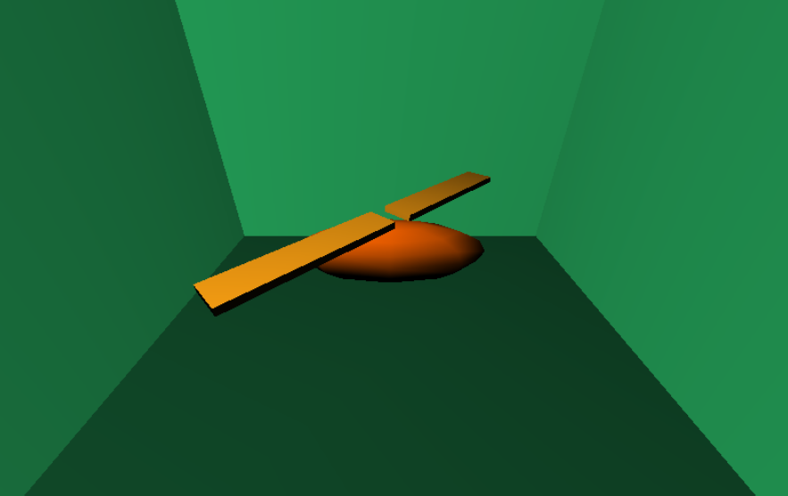
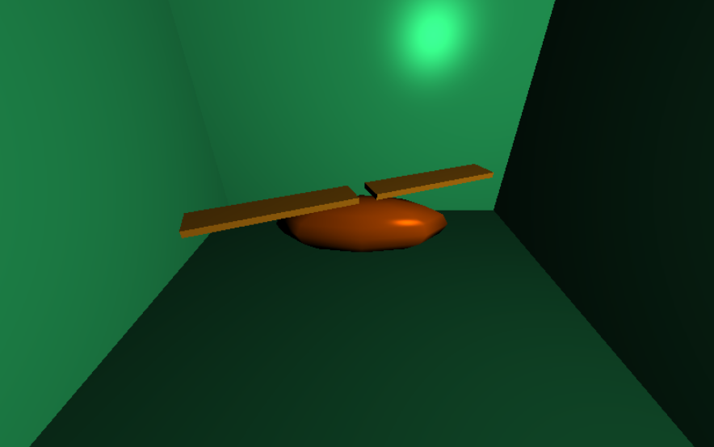

# Homework 2

### Lighting and Shading with GLSL

徐佳怡        516021910396

#### Task 1: Implement Gouraud Shading

Gouraud shading is an interpolation method to produce continuous shading of surfaces. It produces color intensities at all vertices according to Phong lighting model. Then, for each screen pixel covered by the polygonal mesh, color intensities are interpolated from the color values calculated at the vertices.

    Fig.1 The screenshot of the implemented gouraud shader 

#### Task 2:  Implement Phong Shading

Phong  shading is an normal-vector interpolation technique for surface shading. It interpolateds surface normals across rasterized polygons and compute pixel colors based on the interpolated normals and Phong lighting.

 

    Fig. 2 The screenshot of the implemented phong shading

#### Task 3: Compare Gouraud shading with Phong shading

> Why Gouraud shading is missing a specular highlight on the back wall?

The back wall is a polygon and the highlight is more likely to appear in the middle of the back wall. With gouraud shading, the highlight's lighting is calculated through interpolation with 4 vertices, so the highlight will not be apparent and  cannot be rendered correctly. However, with phong shading, the highlight will be rendered right at this vertex, that is the lighting model is applied at the highlight vertex. Therefore, phong shading can show a specular highlight.

 

